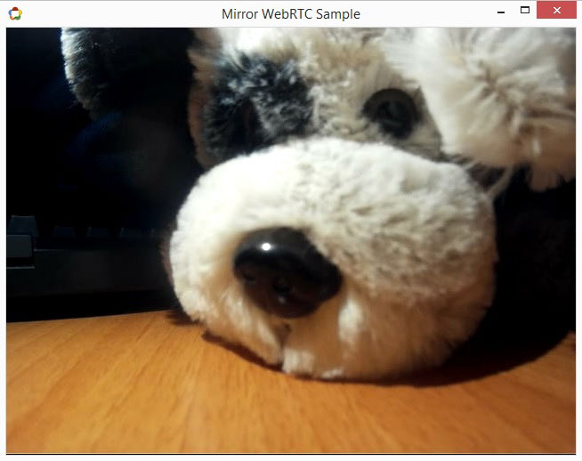

# nw-mirror-webrtc

**nw-mirror-webrtc** is an open source project designed as a basic proof of concept about WebRTC and NW.js

Demo application basically accesses media devices (camera and microphone) and plays the local streams like a real mirror.


## Usage

First of all, you must install the project dependencies:
```
npm install
```

Now, you are ready to start the application:
```
npm start
```

Output here:

  


## License
MIT
